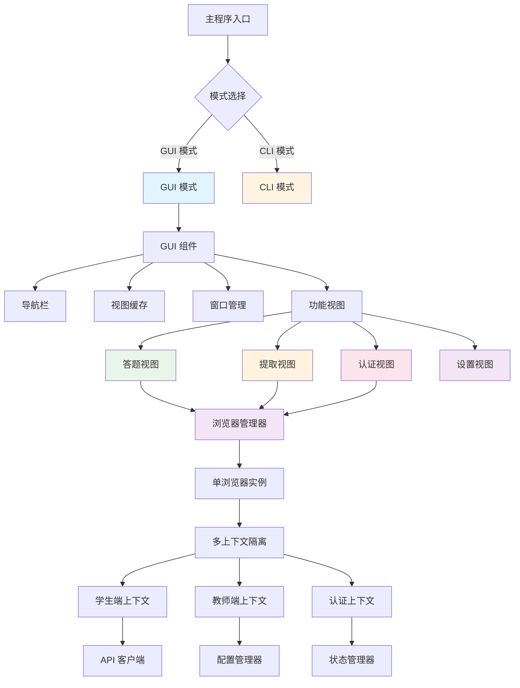
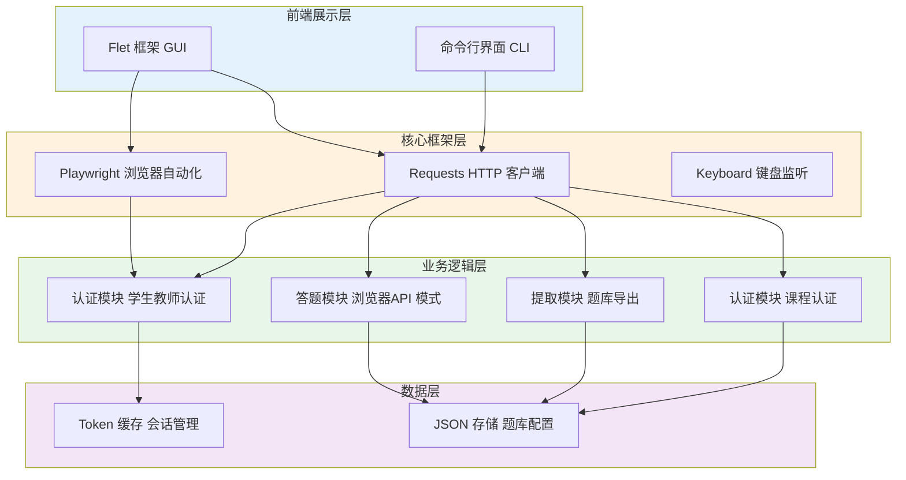
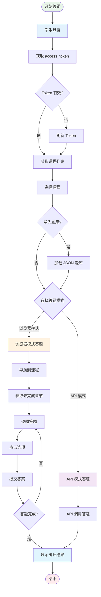
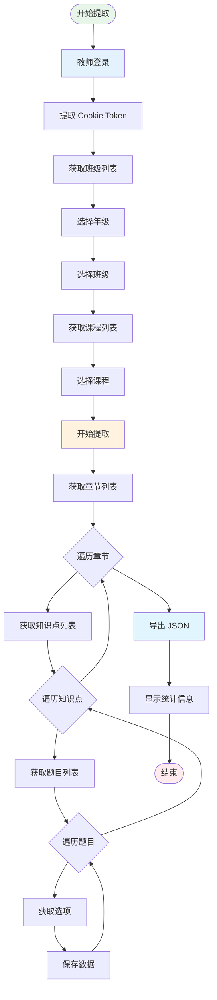

<div align="center">

# ZX Answering Assistant

## 智能答题助手系统

[](https://www.python.org/)
[](LICENSE.txt)
[](https://www.microsoft.com/windows)
[](https://github.com/TianJiaJi/ZX-Answering-Assistant-python/releases)

**一个基于 Playwright 的在线学习平台自动化答题助手系统**

支持 **GUI 图形界面** 和 **CLI 命令行** 两种交互方式，提供浏览器兼容模式和 API 暴力模式两种答题方式。

[功能特性](#功能特性) • [技术架构](#技术架构) • [快速开始](#快速开始) • [使用指南](#使用指南) • [开发指南](#开发指南) • [常见问题](#常见问题)

</div>

---

## 目录

- [程序介绍](#程序介绍)
- [为什么编写这个程序](#为什么编写这个程序)
- [功能特性](#功能特性)
- [技术架构](#技术架构)
- [技术栈](#技术栈)
- [模块介绍](#模块介绍)
- [技术实现](#技术实现)
- [快速开始](#快速开始)
- [使用指南](#使用指南)
- [开发指南](#开发指南)
- [待开发功能](#待开发功能)
- [常见问题](#常见问题)
- [版本历史](#版本历史)
- [许可证](#许可证)

---

## 程序介绍

**ZX Answering Assistant（智能答题助手）** 是一个专为在线学习平台设计的自动化工具，旨在通过浏览器自动化技术和 API 逆向工程，帮助学生和教师提高学习效率。

### 核心定位

- **学生端**: 自动化答题、课程进度管理、学习数据统计
- **教师端**: 题库提取、教学辅助、学情分析
- **课程认证**: 快速完成课程认证要求

### 设计目标

1. **效率优先**: 通过自动化工具减少重复性劳动，让用户专注于知识理解
2. **用户友好**: 提供直观的 GUI 界面和强大的 CLI 命令行工具
3. **技术先进**: 采用最新的浏览器自动化技术和智能匹配算法
4. **安全可靠**: 智能速率控制、自动重试、崩溃恢复等机制确保稳定运行

### 适用场景

- **学生日常学习**: 快速完成在线练习题，获取学习反馈
- **教师教学准备**: 提取课程题库用于备课和考试设计
- **学习进度管理**: 实时追踪课程完成情况
- **题库资源建设**: 导出标准化的 JSON 格式题库

---

## 为什么编写这个程序

### 项目背景

在现代在线教育环境中，学生和教师经常面临以下挑战：

#### 1. 重复性学习任务效率低下

学生需要完成大量的在线练习题来巩固知识，但手动答题效率低下：

- 每门课程可能有数百道题目
- 重复性选择题占据大量时间
- 手动操作容易出错

#### 2. 答案提取困难

教师想要获取课程题库用于备课或分析，但缺少自动化工具：

- 平台不提供批量导出功能
- 手动复制题目效率极低
- 难以进行学情数据分析

#### 3. 学习进度管理困难

难以追踪课程完成情况和知识点掌握程度：

- 不清楚哪些章节已完成
- 无法直观了解学习进度
- 缺乏学习数据统计

#### 4. 时间效率问题

重复性答题过程占用大量学习时间，影响学习效率：

- 机械性操作浪费宝贵时间
- 无法专注于重点难点
- 降低学习体验

### 解决方案

ZX Answering Assistant 应运而生，旨在：

#### 提高学习效率

- **自动化答题流程**: 支持浏览器模式（模拟真实操作）和 API 模式（极速答题）
- **智能答案匹配**: 基于文本相似度算法自动匹配正确答案
- **批量处理**: 支持多课程、多章节连续答题

#### 辅助教师工作

- **快速提取题库**: 一键导出完整课程题库（JSON 格式）
- **教学数据支持**: 提供知识点、题目、选项等完整数据结构
- **学情分析辅助**: 结构化数据便于后续分析处理

#### 智能化管理

- **实时进度追踪**: 显示课程完成百分比、题目数量统计
- **智能速率控制**: 避免触发平台检测机制
- **自动化重试**: 网络错误自动恢复，确保任务完成

#### 降低学习成本

- **节省时间**: 将数小时的答题任务缩短至几分钟
- **提升体验**: 专注于知识理解而非机械操作
- **开源共享**: 免费开源，欢迎社区贡献改进

### 设计理念

- **用户友好**: 提供直观的 GUI 界面和传统 CLI 界面，满足不同用户需求
- **技术先进**: 采用最新的浏览器自动化技术（Playwright）和 API 逆向工程
- **安全可靠**: 智能速率控制、自动重试、崩溃恢复等机制确保稳定运行
- **开源共享**: Apache 2.0 开源协议，欢迎社区贡献和改进

---

## 功能特性

### 双界面支持

| 界面类型           | 特点                                                       | 适用场景             |
| ------------------ | ---------------------------------------------------------- | -------------------- |
| **GUI 模式** | 现代化图形界面，操作简单直观，实时进度显示，基于 Flet 框架 | 普通用户日常使用     |
| **CLI 模式** | 命令行界面，支持脚本自动化，适合批量操作                   | 高级用户和自动化集成 |

### 学生端功能

#### 自动答题系统

- **自动登录**: 支持账户密码自动登录学生端，无需手动操作
- **课程管理**: 图形化显示课程列表和完成进度，一目了然
- **智能答题**: 两种模式可选
  - **浏览器兼容模式**: 模拟真实用户操作，点击选项完成答题（约 2-3 题/秒）
  - **API 暴力模式**: 直接调用 API 接口，速度极快（约 10-20 题/秒）
- **网络重试**: 连接失败自动重试（最多 3 次），确保答题成功率
- **优雅退出**: 按 Q 键随时停止，等待当前题目完成再退出
- **实时统计**: 显示答题成功率、完成进度、用时统计
- **题库导入**: 支持 JSON 格式题库导入，辅助答案匹配
- **进度监控**: 实时追踪课程完成情况，显示完成百分比
- **浏览器崩溃恢复**: 浏览器意外退出后可自动重新登录恢复
- **统一浏览器管理**: v2.6.0+ 单浏览器实例多上下文，降低资源占用

#### 课程认证答题 (v2.6.0+)

- **题库导入**: 支持 JSON 格式题库导入
- **API 快速答题**: 直接调用 API 接口答题
- **文本智能匹配**: 基于文本相似度匹配答案
- **实时日志**: 显示答题进度和统计信息

### 安全微伴功能 (WeBan) ✨

#### 自动学习系统

- **自动登录**: 支持账户密码自动登录，可选 OCR 验证码识别
- **智能学习**: 自动完成必修课、推送课、自选课的学习任务
- **可配置时长**: 支持自定义每门课程的学习时长（秒）
- **重新学习模式**: 支持强制重新学习已完成的课程
- **实验室课程**: 自动加载并处理实验室课程项目
- **实时进度**: 显示必修课、推送课、自选课、考试的完成进度

#### 智能考试系统

- **题库同步**: 自动从考试历史中同步最新题库
- **智能答题**: 基于题库自动匹配正确答案
- **手动答题**: 题库中不存在的题目支持手动输入
- **可复制题目**: GUI 模式下题目文本可选择复制，方便 AI 辅助答题
- **重考确认**: 支持选择是否重考已完成的考试
- **多项目支持**: 自动处理多个考试项目
- **实时统计**: 显示题库覆盖率、答题成功率

#### 核心特性

- **OCR 验证码识别**: 集成 ddddocr 库，自动识别验证码（失败 3 次后手动输入）
- **腾讯云验证码兼容**: 支持腾讯云验证码的手动处理流程
- **学校代码验证**: 支持学校全称模糊搜索和验证
- **GUI 友好**: 完整的图形界面支持，包括验证码输入、重考确认、手动答题等交互场景

### 教师端功能

#### 答案提取系统

- **教师登录**: 图形化登录界面，专业的紫色主题
- **智能选择**: 左右分栏设计，先选年级再选班级
- **课程卡片**: 卡片化展示所有课程，信息清晰
- **一键提取**: 点击课程卡片即可提取答案，实时进度显示
- **自动保存**: 提取完成自动保存为 JSON 文件
- **提取统计**: 显示知识点数量、题目数量、选项数量
- **文件管理**: 一键打开文件夹、复制文件路径

### 核心特性

#### 技术特性

| 特性                     | 描述                                    | 版本   |
| ------------------------ | --------------------------------------- | ------ |
| **智能速率控制**   | 可配置的 API 请求速率限制，避免触发检测 | v1.0   |
| **自动重试机制**   | 网络错误自动重试，最多 3 次             | v1.0   |
| **浏览器崩溃恢复** | 自动检测浏览器崩溃并重新登录            | v2.2.0 |
| **AsyncIO 兼容**   | GUI 模式完全兼容 Playwright 同步 API    | v2.2.0 |
| **统一浏览器管理** | 单浏览器实例 + 多上下文隔离             | v2.6.0 |
| **源码自动清理**   | 打包后自动删除 .py 源码，只保留 .pyc    | v2.6.6 |
| **构建系统优化**   | 配置文件化、增量构建、构建速度提升      | v2.7.0 |
| **WeBan 模块集成** | 安全微伴课程自动化，支持 OCR 验证码识别 | v2.9.0 |

#### 答题模式对比

| 特性               | 浏览器兼容模式     | API 暴力模式       |
| ------------------ | ------------------ | ------------------ |
| **速度**     | 较慢               | 较快               |
| **稳定性**   | 高（模拟真实操作） | 高（API 调用）     |
| **资源占用** | 高（需要浏览器）   | 低（仅 HTTP 请求） |
| **检测风险** | 较低（模拟真人）   | 中等（API 调用）   |
| **推荐场景** | 验证答案准确性     | 快速刷题           |

---

## 技术架构

### 系统架构图



### 分层架构

```mermaid
graph TB
    subgraph Presentation[表现层]
        GUI[GUI 界面 Flet]
        CLI[CLI 界面]
    end

    subgraph Business[业务逻辑层]
        Answering[答题模块]
        Extraction[提取模块]
        Certification[认证模块]
    end

    subgraph Services[服务层]
        AuthService[认证服务]
        BrowserService[浏览器服务]
        APIService[API 服务]
    end

    subgraph Data[数据层]
        FileStorage[文件存储]
        ConfigStorage[配置存储]
        CacheData[缓存管理]
    end

    GUI --> Answering
    GUI --> Extraction
    GUI --> Certification

    CLI --> Answering
    CLI --> Extraction
    CLI --> Certification

    Answering --> AuthService
    Answering --> BrowserService
    Answering --> APIService

    Extraction --> AuthService
    Extraction --> BrowserService
    Extraction --> APIService

    Certification --> AuthService
    Certification --> APIService

    AuthService --> ConfigStorage
    BrowserService --> CacheData
    APIService --> FileStorage

    style Presentation fill:#e3f2fd
    style Business fill:#e8f5e9
    style Services fill:#fff3e0
    style Data fill:#f3e5f5
```



---

## 技术栈

### 核心依赖

| 依赖                 | 版本     | 用途         | 说明                                   |
| -------------------- | -------- | ------------ | -------------------------------------- |
| **flet**       | ≥0.82.0 | GUI 框架     | 现代化跨平台桌面应用框架，基于 Flutter |
| **playwright** | ≥1.57.0 | 浏览器自动化 | 用于登录、token 提取、浏览器模式答题   |
| **requests**   | ≥2.31.0 | HTTP 客户端  | API 调用、网络请求                     |
| **keyboard**   | ≥0.13.5 | 键盘监听     | 优雅退出功能（Q 键监听）               |

### WeBan 模块依赖

| 依赖                   | 版本     | 用途           | 说明                   |
| ---------------------- | -------- | -------------- | ---------------------- |
| **ddddocr**      | 1.6.1    | OCR 验证码识别 | 自动识别验证码（可选） |
| **loguru**       | 0.7.3    | 日志处理       | 优雅的日志输出         |
| **pycryptodome** | 3.23.0   | 加密解密       | 数据加密处理           |
| **Pillow**       | ≥10.0.0 | 图像处理       | 图像操作和处理         |

### 开发依赖

| 依赖                  | 版本     | 用途         |
| --------------------- | -------- | ------------ |
| **pyinstaller** | ≥6.0.0  | 打包工具     |
| **pyyaml**      | ≥6.0    | 配置文件解析 |
| **py7zr**       | ≥0.21.0 | 压缩文件处理 |

**注意**: v2.8.5+ 已移除测试套件，准备后续重构。

### API 端点

#### 学生端 API

- **基础地址**: `https://ai.cqzuxia.com/`
- **认证接口**: `/connect/token` - OAuth2 令牌获取
- **业务接口**: 课程列表、进度、答题等接口

#### 教师端 API

- **基础地址**: `https://admin.cqzuxia.com/`
- **业务接口**: `/evaluation/api/TeacherEvaluation/*` - 答案提取接口

#### 课程认证 API (v2.6.0+)

- **基础地址**: `https://zxsz.cqzuxia.com/teacherCertifiApi/api/TeacherCourseEvaluate`
- **业务接口**: 课程认证答题接口

### 技术栈关系图



---

## 模块介绍

### 项目目录结构

```
ZX-Answering-Assistant-python/
├── src/                              # 源代码目录
│   ├── core/                         # 核心模块
│   │   ├── __init__.py
│   │   ├── api_client.py             # API 客户端（统一请求接口）
│   │   ├── app_state.py              # 应用状态管理
│   │   ├── browser.py                # 浏览器管理器（单例模式）
│   │   ├── config.py                 # 配置管理器（持久化）
│   │   └── constants.py              # 应用常量定义
│   │
│   ├── auth/                         # 认证模块
│   │   ├── __init__.py
│   │   ├── student.py                # 学生端登录
│   │   ├── teacher.py                # 教师端登录
│   │   └── token_manager.py          # Token 缓存管理
│   │
│   ├── answering/                    # 答题模块
│   │   ├── __init__.py
│   │   ├── api_answer.py             # API 模式答题
│   │   └── browser_answer.py         # 浏览器模式答题
│   │
│   ├── certification/                # 课程认证模块
│   │   ├── __init__.py
│   │   ├── workflow.py               # 课程认证工作流
│   │   └── api_answer.py             # 课程认证 API 答题
│   │
│   ├── extraction/                   # 数据提取模块
│   │   ├── __init__.py
│   │   ├── extractor.py              # 答案提取器
│   │   ├── exporter.py               # 数据导出器
│   │   ├── importer.py               # 题库导入器
│   │   └── file_handler.py           # 文件处理工具
│   │
│   ├── ui/                           # GUI 界面模块
│   │   ├── __init__.py
│   │   ├── main_gui.py               # GUI 主程序
│   │   └── views/                    # 视图组件
│   │       ├── __init__.py
│   │       ├── answering_view.py         # 答题视图
│   │       ├── extraction_view.py        # 提取视图
│   │       ├── course_certification_view.py  # 课程认证视图
│   │       ├── cloud_exam_view.py        # 云考试视图（占位）
│   │       ├── evaluation_view.py        # 评估出题视图（占位）
│   │       └── settings_view.py          # 设置视图
│   │
│   ├── utils/                        # 工具模块
│   │   ├── __init__.py
│   │   └── retry.py                  # 重试机制工具
│   │
│   ├── caching/                      # 缓存模块
│   │   └── __init__.py
│   │
│   ├── modules/                      # 扩展模块
│   │   ├── __init__.py
│   │   ├── weban_adapter.py          # WeBan 适配器
│   │   ├── weban_runner.py           # WeBan 运行器
│   │   └── WeBan/                    # WeBan 核心模块
│   │       ├── __init__.py
│   │       ├── api.py                # WeBan API 封装
│   │       └── client.py             # WeBan 客户端
│   │
│   └── extract_answers.py            # 独立提取脚本（遗留）
│
├── main.py                           # 主程序入口
├── build.py                          # 构建脚本
├── version.py                        # 版本信息
├── requirements.txt                  # 依赖列表
├── build_config.yaml                 # 构建配置
├── CLAUDE.md                         # Claude Code 指导文档
└── README.md                         # 项目文档
```

### 核心模块详解

#### 1. 浏览器管理器 (BrowserManager)

**位置**: `src/core/browser.py`

**核心功能**:

- 单浏览器实例管理（单例模式）
- 多上下文隔离（学生端、教师端、课程认证）
- 线程安全的工作队列
- AsyncIO 兼容性（Flet GUI 友好）
- Playwright 1.57.0+ headless 模式兼容

**关键特性**:

- **资源优化**: 整个应用只运行一个 Playwright 浏览器实例
- **完全隔离**: 每个模块有独立的 BrowserContext，Cookie、Session、LocalStorage 互不干扰
- **线程安全**: 所有 Playwright 操作在专用工作线程中执行

**使用示例**:

```python
from src.core.browser import get_browser_manager, BrowserType

# 获取单例实例
browser_manager = get_browser_manager()

# 启动浏览器
browser = browser_manager.start_browser(headless=False)

# 获取隔离的上下文
student_context = browser_manager.get_context(BrowserType.STUDENT)
teacher_context = browser_manager.get_context(BrowserType.TEACHER)
cert_context = browser_manager.get_context(BrowserType.COURSE_CERTIFICATION)

# 清理特定上下文
browser_manager.close_context(BrowserType.STUDENT)

# 关闭整个浏览器
browser_manager.stop_browser()
```

#### 2. API 客户端 (APIClient)

**位置**: `src/core/api_client.py`

**核心功能**:

- 统一的 HTTP 请求接口
- 智能速率限制（可配置）
- 自动重试机制（指数退避）
- 请求缓存（TTL）
- 错误处理

**速率级别**:

- `low`: 50ms - 无速率限制的 API
- `medium`: 1s - 默认级别，推荐
- `medium_high`: 2s - 较严格限制
- `high`: 3s - 严格限制

**使用示例**:

```python
from src.core.api_client import get_api_client

api_client = get_api_client()
response = api_client.get(url, headers=headers)
```

#### 3. 配置管理器 (SettingsManager)

**位置**: `src/core/config.py`

**核心功能**:

- 持久化配置存储（JSON 格式）
- 凭证管理（学生端、教师端）
- API 设置（速率级别、重试次数）

**配置文件**: `cli_config.json`

```json
{
  "student_credentials": {
    "username": "",
    "password": ""
  },
  "teacher_credentials": {
    "username": "",
    "password": ""
  },
  "api_settings": {
    "rate_level": "medium",
    "max_retries": 3
  }
}
```

#### 4. 认证模块

**学生端认证** (`src/auth/student.py`):

- OAuth2 登录流程
- Token 自动捕获
- 多策略登录按钮点击（类选择器 → 文本选择器 → JavaScript 回退）
- AsyncIO 兼容性

**教师端认证** (`src/auth/teacher.py`):

- 教师端登录流程
- Cookie 提取（`smartedu.admin.token`）
- API 认证

**Token 管理** (`src/auth/token_manager.py`):

- Token 缓存
- 有效期管理（5 小时）
- 自动刷新

#### 5. 答题模块

**浏览器模式答题** (`src/answering/browser_answer.py`):

- 模拟真实用户操作
- 点击选项按钮
- 提交答案
- 优雅退出（Q 键监听）

**API 模式答题** (`src/answering/api_answer.py`):

- 直接调用 API
- 速度极快
- 网络重试机制
- 实时统计

#### 6. 数据提取模块

**提取器** (`src/extraction/extractor.py`):

- 完整的答案提取流程
- API 调用链：班级 → 课程 → 章节 → 知识点 → 题目 → 选项
- 进度回调支持（GUI 友好）

**数据流**:


**导出器** (`src/extraction/exporter.py`):

- JSON 格式导出
- 结构化数据存储
- 自动文件命名

**导入器** (`src/extraction/importer.py`):

- JSON 题库导入
- 数据验证
- 题库解析

#### 7. GUI 模块

**主程序** (`src/ui/main_gui.py`):

- Flet 应用入口
- 视图缓存机制
- 窗口清理处理
- 导航管理

**视图组件** (`src/ui/views/`):

- **answering_view.py**: 学生端答题界面
- **extraction_view.py**: 教师端提取界面
- **course_certification_view.py**: 课程认证界面
- **weban_view.py**: 安全微伴（WeBan）界面
- **cloud_exam_view.py**: 云考试界面（占位符）
- **evaluation_view.py**: 评估出题界面（占位符）
- **settings_view.py**: 设置管理界面

#### 8. WeBan 模块

**适配器** (`src/modules/weban_adapter.py`):

- WeBan 模块的 GUI 适配层
- 多任务配置管理
- 进度回调支持
- 输入回调处理（验证码、重考确认、手动答题）

**客户端** (`src/modules/WeBan/client.py`):

- 自动学习流程（必修课、推送课、自选课）
- 智能考试系统
- OCR 验证码识别
- 题库同步

**视图组件** (`src/ui/views/weban_view.py`):

- 三页面设计：简介 → 登录 → 控制台
- 验证码输入对话框
- 手动答题对话框（支持复制题目）
- 测试输入功能

**输入对话框** (`src/ui/dialogs/input_dialog.py`):

- 通用输入对话框
- 验证码图片对话框
- 手动答题对话框（可复制题目）
- 支持一键复制题目（需安装 pyperclip）

---

## 技术实现

### 学生端答题流程



### 教师端答案提取流程



### 速率限制机制

#### 为什么需要速率限制？

1. **避免触发平台检测**: 过快的请求频率可能被识别为机器人
2. **保证系统稳定**: 避免因请求过快导致的服务器错误
3. **模拟真实用户**: 正常用户的答题速度是有限的

#### 实现方式

```python
class APIClient:
    def __init__(self, rate_level: APIRateLevel = APIRateLevel.MEDIUM):
        self.rate_delays = {
            APIRateLevel.LOW: 0.05,        # 50ms
            APIRateLevel.MEDIUM: 1.0,      # 1s
            APIRateLevel.MEDIUM_HIGH: 2.0, # 2s
            APIRateLevel.HIGH: 3.0         # 3s
        }

    def request(self, method, url, **kwargs):
        # 应用速率限制延迟
        delay = self.rate_delays[self.rate_level]
        time.sleep(delay)

        # 发送请求
        response = requests.request(method, url, **kwargs)

        # 处理错误和重试
        return self._handle_response(response)
```

### 学生 API 答题签名机制

#### 签名概述

学生端 API 接口实现了基于 **HMAC-SHA256** 的签名验证机制，用于确保请求的合法性和数据完整性。所有答题相关的 API 请求都必须携带正确的签名参数。

#### 签名密钥

系统使用固定的签名密钥：

```python
SIGN_KEY = "2fa7a73c-66d4-11f0-8925-fa163e54f941"
```

#### 签名算法

使用 **HMAC-SHA256** 算法生成签名：

```python
import hmac
import hashlib

def generate_sign(params: str) -> str:
    """
    生成签名

    Args:
        params: 参数字符串（URL编码前的原始查询字符串）

    Returns:
        str: 十六进制小写签名字符串
    """
    signature = hmac.new(
        SIGN_KEY.encode('utf-8'),
        params.encode('utf-8'),
        hashlib.sha256
    ).hexdigest()

    return signature
```

#### 签名参数构造

**关键规则**：

1. **签名原文使用小写字段名**

   - 例如：`questionid`, `answerid`
2. **请求体使用大写字段名**

   - 例如：`QuestionID`, `AnswerID`
3. **签名不进行 URL 编码**

   - 直接对原始参数字符串进行签名
   - URL 编码只在构造查询参数时使用
4. **JSON 使用紧凑格式**

   - 使用 `separators=(',', ':')` 去除空格

#### 签名使用场景

**场景 1: 开始测评** (beginevaluate)

```python
# 签名原文（未编码）
params_raw = f"kpid={kpid}"

# 生成签名
sign = generate_sign(params_raw)

# 构造 URL（需要 URL 编码）
params_encoded = urlencode({"kpid": kpid, "sign": sign})
url = f"{BASE_URL}/studentevaluate/beginevaluate?{params_encoded}"
```

**场景 2: 保存答案** (SaveEvaluateAnswer)

```python
# 签名时使用小写字段名
questions_for_sign = [{"questionid": question_id, "answerid": answer_id}]
questions_json = json.dumps(questions_for_sign, separators=(',', ':'), ensure_ascii=False)

# 构造签名原文
params_raw = f"kpid={kpid}&questions={questions_json}"

# 生成签名
sign = generate_sign(params_raw)

# 构造请求体（使用大写字段名）
body = {
    "kpid": kpid,
    "questions": [{"QuestionID": question_id, "AnswerID": answer_id}],
    "sign": sign
}
```

**场景 3: 提交试卷** (SaveTestMemberInfo)

```python
# 空数组表示已完成
questions_json = "[]"

# 构造签名原文
params_raw = f"kpid={kpid}&questions={questions_json}"

# 生成签名
sign = generate_sign(params_raw)

# 构造请求体
body = {
    "kpid": kpid,
    "questions": [],
    "sign": sign
}
```

#### 完整请求示例

```python
from src.answering.api_answer import APIAutoAnswer

# 初始化答题器（需要有效的 access_token）
answerer = APIAutoAnswer(access_token="your_token_here")

# 开始测评（获取题目）
kpid = "知识点ID"
evaluate_data = answerer.begin_evaluate(kpid)

# 保存单题答案
question_id = "题目ID"
answer_id = "答案ID"
success = answerer.save_evaluate_answer(kpid, question_id, answer_id)

# 提交试卷
success = answerer.save_test_member_info(kpid)
```

#### 请求头设置

所有 API 请求都需要携带以下请求头：

```python
def _get_headers(self) -> Dict:
    return {
        "accept": "application/json, text/plain, */*",
        "accept-language": "zh-CN,zh;q=0.9",
        "authorization": f"Bearer {self.access_token}",
        "content-type": "application/json;charset=UTF-8",
        "origin": "https://ai.cqzuxia.com",
        "referer": "https://ai.cqzuxia.com/",
        "sec-ch-ua": '"Chromium";v="138", "Not)A;Brand";v="8"',
        "sec-ch-ua-mobile": "?0",
        "sec-ch-ua-platform": '"Windows"',
        "sec-fetch-dest": "empty",
        "sec-fetch-mode": "cors",
        "sec-fetch-site": "same-origin",
        "user-agent": "Mozilla/5.0 (Windows NT 10.0; Win64; x64) AppleWebKit/537.36"
    }
```

#### 重要提示

1. **字段名大小写敏感**

   - 签名原文必须使用小写字段名
   - 请求体必须使用大写字段名
   - 这是实现中最容易出错的地方
2. **多选题答案格式**

   - 多个答案 ID 用逗号分隔
   - 例如：`"id1,id2,id3"`
3. **签名密钥保密**

   - 签名密钥硬编码在代码中
   - 不要在公开场合泄露
4. **Token 管理**

   - access_token 有效期为 5 小时
   - 过期后需要重新登录获取

### AsyncIO 兼容性

#### 问题

Flet 框架使用 asyncio 事件循环，但 Playwright 的同步 API 无法在 asyncio 循环中运行。

#### 解决方案

检测 asyncio 环境，在独立线程中运行 Playwright：

```python
def login_in_asyncio_context():
    try:
        import asyncio
        asyncio.get_running_loop()
        # 检测到 asyncio 环境

        import threading
        result = [None]

        def run_in_new_loop():
            new_loop = asyncio.new_event_loop()
            asyncio.set_event_loop(new_loop)
            # 在新线程中运行 Playwright 代码
            result[0] = _do_login()

        thread = threading.Thread(target=run_in_new_loop)
        thread.start()
        thread.join()

        return result[0]

    except RuntimeError:
        # 没有 asyncio 循环，直接运行
        return _do_login()
```

### 浏览器崩溃恢复

#### 检测机制

```python
def check_browser_alive():
    """检查浏览器是否仍然连接"""
    global _browser_instance
    if _browser_instance is None:
        return False
    try:
        # 尝试访问浏览器上下文
        _browser_instance.contexts
        return True
    except Exception:
        return False
```

#### 恢复流程

1. 检测浏览器崩溃
2. 清理旧资源（关闭浏览器、停止 Playwright）
3. 提示用户重新登录
4. 重启浏览器
5. 继续操作

### Playwright 1.57.0+ 兼容性

#### 问题

Playwright 1.57.0+ 引入了 `chromium_headless_shell`，在打包环境中不支持。

#### 解决方案

使用 `args=['--headless=new']` 强制使用完整 Chromium：

```python
browser = playwright.chromium.launch(
    headless=headless,
    args=['--headless=new'] if headless else None  # 强制完整 Chromium
)
```

### 数据结构

#### 单课程导出格式

```json
{
  "class": {
    "class_id": "123",
    "class_name": "2024级计算机1班",
    "course": {
      "course_id": "456",
      "course_name": "Python程序设计",
      "chapters": [
        {
          "chapter_id": "1",
          "chapter_name": "第一章",
          "knowledges": [
            {
              "knowledge_id": "1",
              "knowledge_name": "知识点1",
              "questions": [
                {
                  "question_id": "1",
                  "question_content": "题目内容",
                  "options": [
                    {
                      "id": "1",
                      "content": "选项A",
                      "is_correct": true
                    }
                  ]
                }
              ]
            }
          ]
        }
      ]
    }
  }
}
```

---

## 快速开始

### 环境要求

- **Python**: 3.8 或更高版本
- **操作系统**: Windows 10/11（推荐）
- **网络**: 稳定的互联网连接
- **浏览器**: Chromium（自动安装）
- **内存**: 建议 4GB 以上
- **磁盘空间**: 至少 500MB 可用空间

### 1. 克隆项目

```bash
git clone https://github.com/TianJiaJi/ZX-Answering-Assistant-python.git
cd ZX-Answering-Assistant-python
```

### 2. 创建虚拟环境

**Windows**:

```bash
python -m venv venv
venv\Scripts\activate
```

**Linux/Mac**:

```bash
python3 -m venv venv
source venv/bin/activate
```

### 3. 安装依赖

```bash
# 安装 Python 依赖
pip install -r requirements.txt

# 安装 Playwright 浏览器（必需）
python -m playwright install chromium
```

### 4. 运行程序

#### GUI 模式（推荐）

```bash
python main.py
# 或
python main.py --mode gui
```

#### CLI 模式

```bash
python main.py --cli
```

### 5. 首次使用

1. **GUI 模式**:

   - 启动后会显示主界面
   - 选择需要的功能模块（答题/提取/认证）
   - 输入账号密码登录
   - 开始使用
2. **CLI 模式**:

   - 按照菜单提示选择功能
   - 输入相应的选项编号
   - 根据提示完成操作

---

## 使用指南

### GUI 模式使用

#### 启动应用

在命令行中执行：

```bash
python main.py
```

或者双击运行打包后的可执行文件（.exe）。

#### 导航结构

```
┌──────────────────────────────────┐
│  首页                               │  - 欢迎页面
│  评估答题                           │  - 学生端答题
│  答案提取                           │  - 教师端答案提取
│  课程认证                           │  - 课程认证答题
│  云考试                             │  - 云考试答题（占位）
│  评估出题                           │  - 评估出题管理（占位）
│  设置                               │  - 配置管理
│  关于                               │  - 关于页面
└──────────────────────────────────┘
```

#### 学生端答题流程

**步骤 1: 登录**

1. 导航到"评估答题"页面
2. 输入学生端用户名和密码
3. 点击"登录"按钮
4. 等待登录成功提示

**步骤 2: 导入题库（可选）**

1. 点击"导入题库"按钮
2. 选择 JSON 格式的题库文件
3. 系统会自动加载题库
4. 显示导入成功提示

**步骤 3: 选择课程**

1. 查看课程列表和完成进度
2. 点击想要完成的课程卡片
3. 查看课程详细信息

**步骤 4: 开始答题**

1. 点击"开始答题"按钮
2. 选择答题模式：
   - **API 模式**（推荐）：速度快
   - **浏览器模式**：模拟真实操作
3. 观察实时日志和进度
4. 按 Q 键可随时停止

**步骤 5: 查看结果**

1. 答题完成后显示统计信息
2. 查看成功率、完成进度、用时统计
3. 返回课程列表继续其他课程

#### 课程认证答题流程

**步骤 1: 导航到"课程认证"页面**

**步骤 2: 导入题库**

1. 点击"选择题库文件"按钮
2. 选择 JSON 题库文件
3. 确认题库加载成功

**步骤 3: 开始答题**

1. 点击"开始答题"按钮
2. 观察实时日志
3. 等待答题完成

**步骤 4: 查看结果**

1. 查看答题统计
2. 确认完成情况

#### 教师端答案提取流程

**步骤 1: 登录**

1. 导航到"答案提取"页面
2. 输入教师端用户名和密码
3. 点击"登录"按钮

**步骤 2: 选择年级**

1. 左侧列表显示所有年级（如：2024、2025）
2. 点击选择目标年级

**步骤 3: 选择班级**

1. 右侧列表显示该年级的所有班级
2. 点击选择目标班级

**步骤 4: 提取答案**

1. 查看课程列表
2. 点击课程的"提取答案"按钮
3. 观察实时进度
4. 等待提取完成

**步骤 5: 查看结果**

1. 显示提取统计（知识点、题目、选项数量）
2. 点击"打开文件夹"查看导出的 JSON 文件
3. 点击"复制路径"获取文件路径

### CLI 模式使用

#### 主菜单

```
========================================
     ZX 智能答题助手 - 主菜单
========================================

1. 开始答题
2. 提取问题
3. 设置
4. 退出

请选择功能 (1-4):
```

#### 答题子菜单

```
========================================
        开始答题 - 子菜单
========================================

1. 批量答题
2. 获取学生 access_token
3. 单课程答题
4. 题库导入
5. 返回

请选择功能 (1-5):
```

#### 提取问题子菜单

```
========================================
        提取问题 - 子菜单
========================================

1. 获取教师 access_token
2. 提取所有课程
3. 提取单课程
4. 导出结果
5. 返回

请选择功能 (1-5):
```

### 配置文件

程序运行时会自动生成 `cli_config.json` 配置文件：

```json
{
  "student_credentials": {
    "username": "",
    "password": ""
  },
  "teacher_credentials": {
    "username": "",
    "password": ""
  },
  "api_settings": {
    "rate_level": "medium",
    "max_retries": 3
  }
}
```

**配置说明**:

- `student_credentials`: 学生端账号信息
- `teacher_credentials`: 教师端账号信息
- `rate_level`: API 请求速率级别（low/medium/medium_high/high）
- `max_retries`: 最大重试次数

---

## 开发指南

### 开发环境搭建

```bash
# 1. 克隆项目
git clone https://github.com/TianJiaJi/ZX-Answering-Assistant-python.git
cd ZX-Answering-Assistant-python

# 2. 创建虚拟环境
python -m venv venv
venv\Scripts\activate  # Windows
# source venv/bin/activate  # Linux/Mac

# 3. 安装开发依赖
pip install -r requirements.txt

# 4. 安装 Playwright 浏览器
python -m playwright install chromium

# 5. 运行程序
python main.py          # GUI 模式
python main.py --cli    # CLI 模式
```

### 代码规范

#### 1. 命名规范

- **类名**: 大驼峰命名法 (PascalCase)

  ```python
  class BrowserManager:
      pass
  ```
- **函数/变量**: 小写加下划线 (snake_case)

  ```python
  def get_student_courses():
      pass
  ```
- **常量**: 全大写加下划线

  ```python
  MAX_RETRIES = 3
  ```

#### 2. 文档字符串

使用 Google 风格的文档字符串：

```python
def extract_course_answers(course_id: str, progress_callback=None) -> dict:
    """提取课程答案

    Args:
        course_id: 课程ID
        progress_callback: 进度回调函数

    Returns:
        包含课程信息和答案的字典
    """
    pass
```

#### 3. 错误处理

```python
try:
    result = api_client.get(url, headers=headers)
except requests.exceptions.ConnectionError:
    logger.error("网络连接失败")
    return None
except Exception as e:
    logger.error(f"未知错误: {e}")
    return None
```

### Git 提交规范

使用 Conventional Commits 规范：

```
<type>(<scope>): <subject>

<body>

<footer>
```

**类型 (type)**:

- `feat`: 新功能
- `fix`: 修复 bug
- `docs`: 文档更新
- `style`: 代码格式调整
- `refactor`: 重构
- `chore`: 构建或辅助工具变动
- `gui`: GUI 相关功能

**示例**:

```
feat(student_login): 添加记住密码功能

- 新增密码加密存储
- 添加"记住密码"选项
- 更新 GUI 界面

Closes #123
```

### 构建可执行文件

#### 快速构建

```bash
# 目录模式（推荐，启动快）
python build.py --mode onedir

# 单文件模式（便携，单个文件）
python build.py --mode onefile

# 同时构建两种模式
python build.py --mode both

# 启用 UPX 压缩（减小体积）
python build.py --upx

# 自定义构建目录
python build.py --build-dir D:\BuildOutput
```

#### 构建输出

构建完成后，输出文件在 `dist/` 目录：

**目录模式**:

```
dist/
└── ZX-Answering-Assistant-v2.8.8-windows-x64-installer/
    ├── ZX-Answering-Assistant-v2.8.8-windows-x64-installer.exe
    └── [依赖文件...]
```

**单文件模式**:

```
dist/
└── ZX-Answering-Assistant-v2.8.8-windows-x64-portable.exe
```

### 贡献流程

1. Fork 本项目
2. 创建特性分支 (`git checkout -b feature/AmazingFeature`)
3. 提交更改 (`git commit -m 'feat: add some amazing feature'`)
4. 推送到分支 (`git push origin feature/AmazingFeature`)
5. 开启 Pull Request

---

## 待开发功能

### 1. 云考试模块 (Cloud Exam)

**当前状态**: 占位符实现

**计划功能**:

- [ ] 云考试的题目答题
- [ ] 基于AI 的评估系统自动出题

**技术挑战**:

**API 签名验证差异**:

- 云考试可能使用不同的签名密钥和算法
- 需要逆向分析云考试专用的签名生成逻辑
- 签名参数可能包含时间戳、随机数等动态值

**认证与授权机制**:

- 云考试可能需要独立的认证流程
- 考试 Token 可能与平时学习 Token 不同
- 考试期间可能需要持续的心跳检测

**反作弊检测**:

- 浏览器指纹检测（User-Agent、Canvas、WebGL 等）
- 行为模式分析（鼠标移动、键盘输入节奏）
- 切换窗口检测（失去焦点时触发警告）
- 剪贴板访问检测
- 设备信息比对（IP、MAC 地址等）

**时间限制与同步**:

- 考试倒计时机制需要精确控制
- 服务器时间与本地时间的同步问题
- 网络延迟可能导致超时提交

**题型差异处理**:

- 云考试可能包含当前系统不支持的题型（如编程题、填空题、连线题等）
- 需要扩展答案匹配算法支持新题型
- 主观题（如简答题）的自动评分挑战

**数据一致性要求**:

- 考试过程中网络中断的断点续传
- 答案实时保存机制
- 防止重复提交

**AI 出题的技术难点**:

- 题目难度自动评估算法设计
- 知识点关联度分析
- 题目去重与相似度检测
- 试卷知识点覆盖率计算
- 个性化出题策略（基于学生历史表现）
- 自然语言处理技术用于题目理解

### 2. 评估出题模块 (Assessment Generation)

**当前状态**: 占位符实现（v2.8.5）

**计划功能**:

- [ ] 基于大语言模型题目生成
- [ ] 难度级别配置
- [ ] 知识点覆盖率分析
- [ ] 试卷导出并解析
- [ ] 答案解析生成

**技术挑战**:

- [ ] 程序系统提示词的设计和编写
- [ ] 题目解析
- [ ] 自动上传平台

### 3. 其他计划功能

#### 数据分析增强

- [ ] 学习数据可视化
- [ ] 知识点掌握热力图
- [ ] 学习时间统计
- [ ] 错题本功能

#### 用户体验优化

- [ ] 多语言支持（i18n）
- [ ] 主题定制（暗色模式）
- [ ] 快捷键支持
- [ ] 批量操作优化

#### 系统集成

- [ ] 移动端支持

---

## 常见问题

### Q1: Token 过期了怎么办？

**A**: 系统会自动处理 Token 过期：

- Token 有效期：5 小时
- 系统会提前检测并自动重新获取
- 无需手动干预

**如果遇到 Token 相关错误**，尝试：

1. 重新登录
2. 检查网络连接
3. 清除缓存配置文件

### Q2: 如何调整答题速度？

**A**: 修改 `cli_config.json` 中的 `rate_level`：

```json
{
  "api_settings": {
    "rate_level": "medium"  // low/medium/medium_high/high
  }
}
```

- `low`: 最快（50ms），可能触发检测
- `medium`: 默认（1s），推荐
- `medium_high`: 较慢（2s）
- `high`: 最慢（3s），最安全

### Q3: 编译后的文件为什么这么大？

**A**: 正常现象，主要包含：

1. **Playwright 浏览器**: ~170-200 MB
2. **Flet 框架**: ~50-80 MB
3. **Python 运行时**: ~50-100 MB
4. **依赖库**: ~30-50 MB

**优化方案**：

```bash
# 启用 UPX 压缩（减小 30-50%）
python build.py --upx
```

### Q4: 运行打包后的程序提示"浏览器未安装"怎么办？

**A**: 这是 Playwright 浏览器未正确安装的问题。

#### 方法 1: 自动安装（推荐）

首次运行程序时，程序会自动检测并提示安装浏览器。按照提示操作即可。

#### 方法 2: 手动安装

```bash
# Windows 用户
playwright install chromium

# 或者使用 Python
python -m playwright install chromium
```

#### 方法 3: 使用开发环境（源码运行）

```bash
# 安装依赖
pip install -r requirements.txt

# 安装 Playwright 浏览器
python -m playwright install chromium

# 运行程序
python main.py          # GUI 模式
python main.py --cli    # CLI 模式
```

**提示**: 源码运行比打包版本更稳定，推荐日常使用。

### Q5: 如何选择答题模式？

**A**: 根据需求选择：

| 场景           | 推荐模式           |
| -------------- | ------------------ |
| 快速刷题       | API 模式           |
| 验证答案准确性 | 浏览器模式         |
| 网络不稳定     | API 模式（有重试） |
| 避免检测       | 浏览器模式         |

### Q6: 可以在没有网络的环境使用吗？

**A**: 不可以，所有功能都需要网络连接：

- ❌ **自动答题**: 需要调用平台 API 接口
- ❌ **答案提取**: 需要网络连接
- ❌ **登录认证**: 需要网络连接

**说明**: 题库导入功能只是用来匹配答案的辅助功能，实际答题过程必须连接到在线平台服务器。

### Q7: 浏览器崩溃了怎么办？

**A**: v2.2.0+ 版本支持自动恢复：

1. 系统会自动检测崩溃
2. 提示重新登录
3. 自动重启浏览器
4. 继续未完成的操作

**如果频繁崩溃**：

- 检查系统内存是否充足
- 关闭其他占用内存的程序
- 尝试使用 API 模式答题

### Q8: 如何参与开发？

**A**: 欢迎贡献！

1. 阅读 [开发指南](#开发指南)
2. 查看 [CLAUDE.md](CLAUDE.md) 了解架构细节
3. 选择一个 [Issue](https://github.com/TianJiaJi/ZX-Answering-Assistant-python/issues)
4. Fork 并创建分支
5. 提交 Pull Request

---

## 版本历史

### v2.9.0 (最新) - WeBan 模块集成 ✨

**新增功能**:

- ✅ 集成安全微伴（WeBan）课程自动化模块
- ✅ 支持自动学习（必修课、推送课、自选课、实验室课程）
- ✅ 支持智能考试（题库同步、自动答题、手动答题）
- ✅ OCR 验证码识别（集成 ddddocr）
- ✅ GUI 完整支持（三页面设计：简介 → 登录 → 控制台）
- ✅ 题目文本可复制功能（方便 AI 辅助答题）
- ✅ 测试输入功能（验证所有输入对话框）

**WeBan 模块特性**:

- 🎓 自动学习系统

  - 可配置课程学习时长
  - 重新学习模式支持
  - 实时进度显示
  - 自动处理必修课、推送课、自选课
- 📝 智能考试系统

  - 题库自动同步
  - 智能答案匹配
  - 手动答题支持
  - 重考确认功能
- 🔐 验证码处理

  - OCR 自动识别
  - 失败自动降级为手动输入
  - 腾讯云验证码兼容
- 🖥️ GUI 增强

  - 学校名称验证
  - 实时日志输出
  - 验证码输入对话框
  - 手动答题对话框（可复制题目）
  - 测试输入按钮

**依赖更新**:

- ✅ 添加 ddddocr 1.6.1（OCR 验证码识别）
- ✅ 添加 loguru 0.7.3（日志处理）
- ✅ 添加 pycryptodome 3.23.0（加密解密）
- ✅ 添加 Pillow ≥10.0.0（图像处理）

**鸣谢**:

- 🙏 特别感谢 [WeBan 项目](https://github.com/ylansoft/WeBan) 的原作者
- WeBan 模块基于 [ylansoft/WeBan](https://github.com/ylansoft/WeBan) 项目适配集成

### v2.8.8 - 构建系统优化

**构建系统优化**:

- ✅ 改进浏览器处理逻辑，移至构建后步骤以避免权限问题
- ✅ 优化 Chromium 版本检测机制，确保使用最新版本
- ✅ 添加详细的构建指南文档（BUILD_ADMIN.md）
- ✅ 优化浏览器下载流程和用户提示

**配置清理**:

- ✅ 移除过时的浏览器配置选项
- ✅ 简化 build_config.yaml 配置结构

**其他改动**:

- ✅ 改进版本号检测机制
- ✅ 更新 .gitignore 规则

### v2.8.5 - 稳定性修复和功能优化

**新增功能**:

- ✅ 添加答题进度显示功能
- ✅ 优化日志处理机制
- ✅ 添加评估出题视图模块（占位实现）

**稳定性修复**:

- ✅ 修复 Playwright 浏览器在打包环境中的路径检测问题
- ✅ 优化 main.py 中的浏览器初始化流程
- ✅ 改进浏览器自动安装逻辑，增强用户引导

**项目结构调整**:

- ✅ 删除 tests/ 目录和测试相关文件（准备后续重构）
- ✅ 删除 requirements-dev.txt，合并到 requirements.txt
- ✅ 优化 CLI 界面，添加 emoji 和彩色输出
- ✅ 禁用 CLI 模式日志输出

### v2.8.2 - 稳定性修复和项目结构优化

**稳定性修复**:

- ✅ 修复 Playwright 浏览器在打包环境中的路径检测问题
- ✅ 优化 main.py 中的浏览器初始化流程
- ✅ 改进浏览器自动安装逻辑，增强用户引导
- ✅ 移除过时的修复脚本（version_fix.py、fix_browser_path.py）

**项目结构调整**:

- ✅ 删除 tests/ 目录和测试相关文件（准备后续重构）
- ✅ 删除 requirements-dev.txt，合并到 requirements.txt
- ✅ 优化 CLI 界面，添加 emoji 和彩色输出
- ✅ 禁用 CLI 模式日志输出

**代码清理**:

- ✅ 删除 ~821 行冗余代码（196 行修复脚本 + 625 行测试代码）

### v2.8.0 - UI 优化和配置更新

**新增功能**:

- ✅ CLI 界面美化，添加 emoji 图标
- ✅ CLI 模式禁用日志输出
- ✅ GUI 视图缓存初始化修复
- ✅ 移除代码冗余（379 行重复代码）

### v2.7.0 - 构建系统简化

**新增功能**:

- ✅ 移除复杂的构建工具模块
- ✅ 简化 build.py，保留核心功能
- ✅ 清理 .gitignore 和项目结构

**性能提升**:

- 构建时间从 ~12 分钟缩短到 ~4 分钟（~65% 提升）

### v2.6.6 - 源码自动清理

**修改内容**:

- ✅ 打包后自动删除 .py 源码
- ✅ 保留 .pyc 字节码
- ✅ 减小打包体积

### v2.6.0 - 架构升级（重大更新）

**新增功能**:

- ✅ 统一浏览器管理器（BrowserManager）
- ✅ 多上下文隔离（学生端、教师端、课程认证）
- ✅ 课程认证模块
- ✅ API 模式课程认证答题
- ✅ 线程安全工作队列

**架构改进**:

- 替换旧的 subprocess 模式
- 单浏览器实例 + 多上下文
- 降低资源占用

### v2.2.0 - 浏览器健壮性

**新增功能**:

- ✅ 浏览器崩溃自动恢复
- ✅ 浏览器健康监控
- ✅ AsyncIO 兼容（Flet GUI 友好）

### v1.0.0 - 初始版本

**核心功能**:

- ✅ 学生端自动答题（浏览器模式 + API 模式）
- ✅ 教师端答案提取
- ✅ 智能速率控制
- ✅ 自动重试机制
- ✅ GUI 和 CLI 双界面

---

## 许可证

本项目采用 **Apache License 2.0** 许可证 - 详见 [LICENSE.txt](LICENSE.txt) 文件

---

## 致谢

本项目在开发过程中参考或集成了以下开源项目，特此致谢：

### 核心依赖

- [Flet](https://github.com/flet-dev/flet) - 现代化 Flutter GUI 框架
- [Playwright](https://github.com/microsoft/playwright-python) - 微软开源的浏览器自动化工具
- [Requests](https://github.com/psf/requests) - 优雅的 HTTP 库

### WeBan 模块

特别感谢 **[ylansoft/WeBan](https://github.com/ylansoft/WeBan)** 项目：

- WeBan 是一个优秀的自动化工具
- 本项目中的 WeBan 模块基于该项目的核心代码进行适配和集成
- 保留了原有的 OCR 验证码识别、自动学习、智能考试等核心功能
- 在此基础上添加了 GUI 支持、线程安全适配、输入回调机制等增强功能

**原始项目链接**:

- GitHub: https://github.com/ylansoft/WeBan
- 作者: ylansoft

**本项目改进**:

- ✅ GUI 集成（Flet 框架）
- ✅ 线程安全的输入回调机制
- ✅ 验证码输入对话框优化
- ✅ 手动答题对话框（支持复制题目）
- ✅ 进度回调支持
- ✅ 多任务配置管理
- ✅ 停止信号处理
- ✅ 测试输入功能

### 其他工具

- [ddddocr](https://github.com/sml2h3/ddddocr) - 通用验证码识别库
- [loguru](https://github.com/Delgan/loguru) - 让 Python 日志简单无比
- [Pillow](https://github.com/python-pillow/Pillow) - Python 图像处理库

---

## 免责声明

本项目仅供学习和研究使用，请勿用于商业用途或任何违反服务条款的行为。使用本软件所产生的一切后果由使用者自行承担，作者不承担任何责任。

### 使用须知

1. 本工具仅用于个人学习和研究
2. 请遵守目标平台的使用条款
3. 禁止用于任何商业用途
4. 使用风险自负，作者不承担责任

---

<div align="center">

**如果这个项目对你有帮助，请给个 Star 支持一下！**

Made with ❤️ by ZX Project Team

**问题反馈与功能建议**:

- 📝 提交 [GitHub Issues](https://github.com/TianJiaJi/ZX-Answering-Assistant-python/issues) 报告问题
- 💬 参与 [GitHub Discussions](https://github.com/TianJiaJi/ZX-Answering-Assistant-python/discussions) 讨论功能建议
- 📧 发送邮件至：[blog@mali.tianjiaji.top](mailto:blog@mali.tianjiaji.top)

</div>
